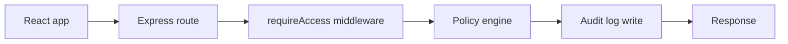

# PolicyGate IAM

PolicyGate is a MERN project that shows the basic IAM ideas behind users, roles, policies, and policy checks without trying to copy AWS IAM.

## Stack

- MongoDB
- Express
- React
- Node.js

## How the request flow works

## What it includes

- Org-scoped users, roles, policies, audit logs, and temporary grants
- JWT login with bcrypt password hashing
- A simple policy evaluation module with deny-wins logic
- Seed data for two sample orgs so the simulator has something to show right away

## Start here

1. Copy `.env.example` to `.env`.
2. Install dependencies with `npm install`.
3. Run the backend seed script with `npm run seed`.
4. Start both apps with `npm run dev`.

The server runs on port `5000` and the client runs on port `5173` by default.

